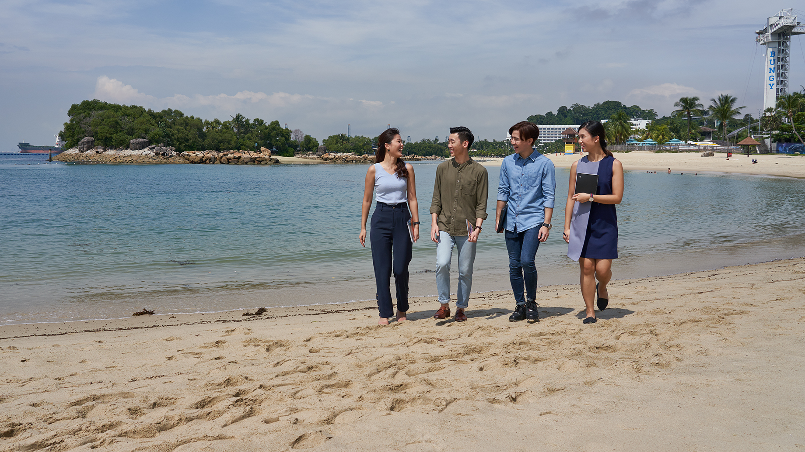
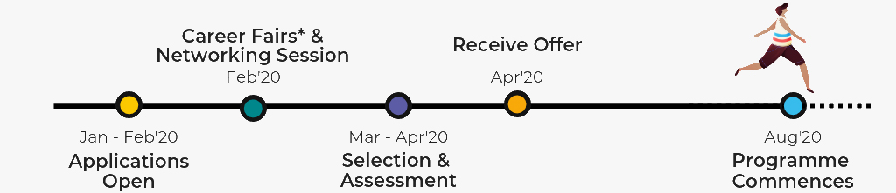
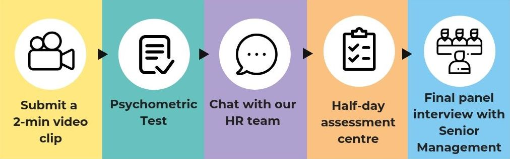

<figure style="margin: 0;position: relative;">

</figure>
 
<h2><b>Graduate Programme</b></h2>
 
<h4><b>For the fun-lovers & fun-makers</b></h4>
 
	
The Sentosa Graduate Development programme is designed to kick-start your career in the tourism industry by exposing you to dynamic job experience and mentorship opportunities aimed at building your leadership capabilities.

 
<h4 style="color: #00DBFF"><b>TIMELINE</b></h4>
  <figure style="margin: 0;">
  
  </figure>
   
<h4><b>*Subject to respective universities' career fair dates</b></h4>
   
<h4 style="color: #00DBFF"><b>YOUR JOURNEY</b></h4>
   

You will be exposed to two months of ground operations on the island and two six-month divisional rotations before your final posting. During your 14 month stint, you will have various opportunities to interact with senior management and gain leadership insights and experience.

 <figure style="margin: 0;">
  
 </figure>
 
<h4 style="color: #00DBFF"><b>WHO SHOULD APPLY</b></h4>
 

The Sentosa Graduate Development Programme is open to all Singaporean/PR fresh graduates with less than two years of work experience. Candidates with the following qualities will be viewed favourably:
  - Good academic results
  - Excellent Co-Curricular Activities track record
  - Strong leadership capabilities
  - High adaptability and eagerness to learn
  - Passion for the tourism industry

 
<h4><b>Application is currently closed. Follow us <a href="https://www.linkedin.com/company/sentosa-development-corporation/">here</a>
 for updates.</b></h4>
  
 <figure style="margin: 0;">
  
 </figure>

